# GIM Flow Simulation: Real-World Example

## Scenario

An AI coding assistant (Claude, running via MCP) is helping a developer build a FastAPI app.
The developer's code crashes with a Pydantic v2 validation error. The agent searches GIM,
finds no match, solves the problem, then submits the solution back to GIM.

---

## Mermaid: Full MCP Tools UX Flow

```mermaid
flowchart TD
    A([AI Agent hits an error]) --> B[gim_search_issues]

    subgraph SEARCH ["1. gim_search_issues"]
        direction TB
        B1[Receive error_message] --> B2["quick_sanitize(error_message)"]
        B2 --> B3["generate_embedding(sanitized_query)"]
        B3 --> B4["search_similar_issues(Qdrant)"]
        B4 --> B5{Results found?}
        B5 -->|Yes| B6["Return ranked results:<br/>issue_id, similarity_score,<br/>canonical_error, root_cause,<br/>has_fix_bundle, fix_summary"]
        B5 -->|No| B7["Return empty results +<br/>sanitization_warnings"]
    end

    B --> SEARCH
    B6 --> C{Agent picks best match}
    B7 --> SOLVE

    C -->|Confidence high enough| D[gim_get_fix_bundle]
    C -->|No good match| SOLVE

    subgraph GETFIX ["2. gim_get_fix_bundle"]
        direction TB
        D1[Receive issue_id] --> D2["get_record(master_issues)"]
        D2 --> D3["query_records(fix_bundles)"]
        D3 --> D4["Return fix_bundle:<br/>summary, fix_steps,<br/>code_changes, env_actions,<br/>verification_steps,<br/>confidence_score"]
    end

    D --> GETFIX
    D4 --> E[Agent applies the fix]
    E --> F[gim_confirm_fix]

    subgraph CONFIRM ["3. gim_confirm_fix"]
        direction TB
        F1["Receive issue_id +<br/>fix_worked (bool)"] --> F2{fix_worked?}
        F2 -->|true| F3["Bayesian update UP<br/>confidence_score += delta<br/>verification_count++"]
        F2 -->|false| F4["Bayesian update DOWN<br/>confidence_score -= delta"]
        F3 --> F5[Log fix_confirmed event]
        F4 --> F5
        F5 --> F6["Return new_confidence_score,<br/>verification_count"]
    end

    F --> CONFIRM

    SOLVE([Agent solves error manually]) --> G[gim_submit_issue]

    subgraph SUBMIT ["4. gim_submit_issue"]
        direction TB
        G1["Receive error_message, root_cause,<br/>fix_summary, fix_steps, ..."] --> G2[Validate required fields]
        G2 --> G3["run_sanitization_pipeline()"]

        subgraph PRIVACY ["Privacy Pipeline"]
            direction TB
            P1["Layer 1: PII Scrubber<br/>(regex)"] --> P2["Layer 2: Secret Detector<br/>(regex + entropy)"]
            P2 --> P3["Layer 3: LLM Sanitizer<br/>(Gemini)"]
            P3 --> P4["Layer 4: MRE Synthesizer<br/>(code cleanup)"]
        end

        G3 --> PRIVACY
        PRIVACY --> G4["quick_sanitize(root_cause)<br/>quick_sanitize(fix_steps)"]
        G4 --> G5["generate_issue_embeddings()<br/>3 vectors: error, cause, fix"]
        G5 --> G6["search_similar_issues(Qdrant)<br/>threshold >= 0.85"]
        G6 --> G7{Similar issue?}
        G7 -->|Yes| G8["Create child_issue<br/>Link to master_issue<br/>Classify contribution_type"]
        G7 -->|No| G9["Create master_issue<br/>Upsert vectors to Qdrant"]
        G8 --> G10[Create fix_bundle]
        G9 --> G10
        G10 --> G11[Log usage_event]
        G11 --> G12["Return issue_id,<br/>fix_bundle_id,<br/>type, sanitization warnings"]
    end

    G --> SUBMIT

    style SEARCH fill:#1a1a2e,stroke:#3b82f6,color:#e2e8f0
    style GETFIX fill:#1a1a2e,stroke:#22c55e,color:#e2e8f0
    style CONFIRM fill:#1a1a2e,stroke:#f59e0b,color:#e2e8f0
    style SUBMIT fill:#1a1a2e,stroke:#a855f7,color:#e2e8f0
    style PRIVACY fill:#0f0f1a,stroke:#ef4444,color:#e2e8f0
```



---

## Block-by-Block Simulation

### Context: The Error

A developer at Acme Corp is building `acme-api` on their MacBook. Their FastAPI endpoint crashes:

```python
# /Users/john.doe/projects/acme-api/src/routes/users.py
from pydantic import BaseModel

class UserCreate(BaseModel):
    name: str
    email: str

@app.post("/users")
async def create_user(user: UserCreate):
    db_url = "postgresql://admin:s3cretP@ss@db.acme-internal.com:5432/acme_prod"
    result = await db.execute(query, user.dict())  # <-- crashes here
    return result
```

The error:

```
File "/Users/john.doe/projects/acme-api/src/routes/users.py", line 14, in create_user
    result = await db.execute(query, user.dict())
AttributeError: 'UserCreate' object has no attribute 'dict'. Did you mean: 'model_dump'?
API key used: sk-ant-api03-abc123xyz...
Connection: postgresql://admin:s3cretP@ss@db.acme-internal.com:5432/acme_prod
```

---

## STEP 1: `gim_search_issues`

### Input (from AI agent)

```json
{
  "error_message": "File \"/Users/john.doe/projects/acme-api/src/routes/users.py\", line 14, in create_user\n    result = await db.execute(query, user.dict())\nAttributeError: 'UserCreate' object has no attribute 'dict'. Did you mean: 'model_dump'?\nAPI key used: sk-ant-api03-abc123xyz...\nConnection: postgresql://admin:s3cretP@ss@db.acme-internal.com:5432/acme_prod",
  "language": "python",
  "framework": "fastapi",
  "provider": "anthropic",
  "limit": 5
}
```

### Block 1a: `quick_sanitize(error_message)`

Runs Layer 1 (PII Scrubber) + Layer 2 (Secret Detector) only. No LLM call.

```
--- PII Scrubber ---
Detected: file path "/Users/john.doe/projects/acme-api/src/routes/users.py"
  -> replaced with [PATH_REDACTED]

--- Secret Detector ---
Detected: API key "sk-ant-api03-abc123xyz..."
  -> replaced with [API_KEY_REDACTED]
Detected: connection string "postgresql://admin:s3cretP@ss@db.acme-internal.com:5432/acme_prod"
  -> replaced with [CONNECTION_STRING_REDACTED]
```

**Output: sanitized query**

```
File "[PATH_REDACTED]", line 14, in create_user
    result = await db.execute(query, user.dict())
AttributeError: 'UserCreate' object has no attribute 'dict'. Did you mean: 'model_dump'?
API key used: [API_KEY_REDACTED]
Connection: [CONNECTION_STRING_REDACTED]
```

**Warnings:**

```json
["file_path_detected", "api_key_detected", "connection_string_detected"]
```

### Block 1b: `generate_embedding(sanitized_query)`

Calls Gemini `gemini-embedding-001` with the sanitized text.

**Output:**

```json
[0.0234, -0.1892, 0.0451, 0.3012, ..., -0.0789]   // 3072-dimensional float vector
```

### Block 1c: `search_similar_issues(Qdrant)`

Cosine similarity search against the `error_signature` named vector.

**Output (in this scenario: no matches)**

```json
{
  "results": [],
  "total_searched": 1847
}
```

### Final Search Response (returned to agent)

```json
{
  "success": true,
  "message": "No matching issues found. Consider solving and submitting via gim_submit_issue.",
  "results": [],
  "sanitization_warnings": [
    "file_path_detected",
    "api_key_detected",
    "connection_string_detected"
  ]
}
```

---

## STEP 2: Agent Solves the Error Manually

The agent recognizes this is a Pydantic v1 -> v2 migration issue.
`.dict()` was renamed to `.model_dump()` in Pydantic v2.

The agent fixes the code and verifies it works. Now it submits to GIM.

---

## STEP 3: `gim_submit_issue`

### Input (from AI agent)

```json
{
  "error_message": "File \"/Users/john.doe/projects/acme-api/src/routes/users.py\", line 14, in create_user\n    result = await db.execute(query, user.dict())\nAttributeError: 'UserCreate' object has no attribute 'dict'. Did you mean: 'model_dump'?\nAPI key used: sk-ant-api03-abc123xyz...\nConnection: postgresql://admin:s3cretP@ss@db.acme-internal.com:5432/acme_prod",
  "error_context": "Migrating Acme Corp's internal user service from Pydantic v1 to v2 at /Users/john.doe/projects/acme-api",
  "code_snippet": "from pydantic import BaseModel\n\nclass AcmeUserCreate(BaseModel):\n    name: str\n    email: str\n    acme_employee_id: str\n\n@app.post(\"/internal/acme/users\")\nasync def create_acme_user(user: AcmeUserCreate):\n    db_url = \"postgresql://admin:s3cretP@ss@db.acme-internal.com:5432/acme_prod\"\n    result = await db.execute(query, user.dict())\n    return result",
  "root_cause": "Pydantic v2 removed the .dict() method from BaseModel. The replacement is .model_dump(). This affects all Acme Corp services using the shared acme-pydantic-models package.",
  "fix_summary": "Replace .dict() with .model_dump() for Pydantic v2 compatibility",
  "fix_steps": [
    "Find all occurrences of .dict() on Pydantic models in /Users/john.doe/projects/acme-api",
    "Replace .dict() with .model_dump()",
    "Replace .json() with .model_dump_json() if present",
    "Run pytest to verify no regressions"
  ],
  "code_changes": [
    {
      "file_path": "/Users/john.doe/projects/acme-api/src/routes/users.py",
      "change_type": "modify",
      "before": "result = await db.execute(query, user.dict())",
      "after": "result = await db.execute(query, user.model_dump())",
      "explanation": "Pydantic v2 renamed .dict() to .model_dump()"
    }
  ],
  "environment_actions": [
    {
      "action": "upgrade",
      "package": "pydantic",
      "version": ">=2.0.0",
      "command": "pip install 'pydantic>=2.0.0'"
    }
  ],
  "verification_steps": [
    {
      "step": "Run the failing endpoint",
      "expected_output": "200 OK with user data"
    },
    {
      "step": "Run test suite",
      "expected_output": "All tests pass"
    }
  ],
  "model": "claude-sonnet-4-20250514",
  "provider": "anthropic",
  "language": "python",
  "framework": "fastapi",
  "language_version": "3.11",
  "framework_version": "0.100.0",
  "os": "darwin"
}
```

---

### Block 3a: Validate Required Fields

Checks `error_message`, `root_cause`, `fix_summary`, `fix_steps` are all non-empty.

**Output:** Pass (all present).

---

### Block 3b: `run_sanitization_pipeline(error_message, error_context, code_snippet)`

#### Layer 1: PII Scrubber (`scrub_pii`)

**Input:** raw `error_message`

```
File "/Users/john.doe/projects/acme-api/src/routes/users.py", line 14, in create_user
    result = await db.execute(query, user.dict())
AttributeError: 'UserCreate' object has no attribute 'dict'. Did you mean: 'model_dump'?
API key used: sk-ant-api03-abc123xyz...
Connection: postgresql://admin:s3cretP@ss@db.acme-internal.com:5432/acme_prod
```

**Processing:**

| Found | Type | Replacement |
|---|---|---|
| `/Users/john.doe/projects/acme-api/src/routes/users.py` | file_path | `[PATH_REDACTED]` |

**Output: PIIScanResult**

```python
PIIScanResult(
    pii_items=[
        DetectedPII(
            pii_type="file_path",
            original_text="/Users/john.doe/projects/acme-api/src/routes/users.py",
            replacement="[PATH_REDACTED]",
            start_pos=6,
            end_pos=58,
        )
    ],
    sanitized_text='File "[PATH_REDACTED]", line 14, in create_user\n    result = await db.execute(query, user.dict())\nAttributeError: \'UserCreate\' object has no attribute \'dict\'. Did you mean: \'model_dump\'?\nAPI key used: sk-ant-api03-abc123xyz...\nConnection: postgresql://admin:s3cretP@ss@db.acme-internal.com:5432/acme_prod',
    pii_types_found={"file_path"},
    remaining_risk=0.1,
    scan_confidence=0.95,
)
```

---

#### Layer 2: Secret Detector (`detect_secrets`)

**Input:** output from Layer 1

```
File "[PATH_REDACTED]", line 14, in create_user
    result = await db.execute(query, user.dict())
AttributeError: 'UserCreate' object has no attribute 'dict'. Did you mean: 'model_dump'?
API key used: sk-ant-api03-abc123xyz...
Connection: postgresql://admin:s3cretP@ss@db.acme-internal.com:5432/acme_prod
```

**Processing:**

| Found | Pattern | Replacement |
|---|---|---|
| `sk-ant-api03-abc123xyz...` | api_key | `[API_KEY_REDACTED]` |
| `postgresql://admin:s3cretP@ss@db.acme-internal.com:5432/acme_prod` | connection_string | `[CONNECTION_STRING_REDACTED]` |

**Output: SecretScanResult**

```python
SecretScanResult(
    secrets=[
        DetectedSecret(
            pattern_name="api_key",
            matched_text="sk-ant-api03-abc123xyz...",
            start_pos=142,
            end_pos=167,
            confidence=0.95,
            action=SecretAction.REMOVE,
        ),
        DetectedSecret(
            pattern_name="connection_string",
            matched_text="postgresql://admin:s3cretP@ss@db.acme-internal.com:5432/acme_prod",
            start_pos=181,
            end_pos=246,
            confidence=0.99,
            action=SecretAction.REMOVE,
        ),
    ],
    sanitized_text='File "[PATH_REDACTED]", line 14, in create_user\n    result = await db.execute(query, user.dict())\nAttributeError: \'UserCreate\' object has no attribute \'dict\'. Did you mean: \'model_dump\'?\nAPI key used: [API_KEY_REDACTED]\nConnection: [CONNECTION_STRING_REDACTED]',
    remaining_risk=0.05,
    scan_confidence=0.97,
)
```

---

#### Layer 3: LLM Sanitizer (`sanitize_error_message_with_llm`)

**Input:** output from Layer 2

```
File "[PATH_REDACTED]", line 14, in create_user
    result = await db.execute(query, user.dict())
AttributeError: 'UserCreate' object has no attribute 'dict'. Did you mean: 'model_dump'?
API key used: [API_KEY_REDACTED]
Connection: [CONNECTION_STRING_REDACTED]
```

**LLM Prompt (sent to Gemini):**

> You are a privacy-focused text sanitizer. Identify and redact any remaining PII,
> company names, internal project names, and domain-specific identifiers.
> Preserve the technical error structure. Replace with generic placeholders.

**LLM identifies:** `create_user` is a generic function name (KEEP), `UserCreate` is a generic class name (KEEP). No remaining PII found.

**Output: LLMSanitizationResult**

```python
LLMSanitizationResult(
    original_text='File "[PATH_REDACTED]", line 14, in create_user\n    result = await db.execute(query, user.dict())\nAttributeError: \'UserCreate\' object has no attribute \'dict\'. Did you mean: \'model_dump\'?\nAPI key used: [API_KEY_REDACTED]\nConnection: [CONNECTION_STRING_REDACTED]',
    sanitized_text='File "[PATH_REDACTED]", line 14, in create_user\n    result = await db.execute(query, user.dict())\nAttributeError: \'UserCreate\' object has no attribute \'dict\'. Did you mean: \'model_dump\'?\nAPI key used: [API_KEY_REDACTED]\nConnection: [CONNECTION_STRING_REDACTED]',
    changes_made=[],
    success=True,
    error=None,
)
```

*(No additional changes needed -- regex layers caught everything.)*

---

#### Layer 3 (context): `sanitize_context_with_llm`

**Input:**

```
Migrating Acme Corp's internal user service from Pydantic v1 to v2 at /Users/john.doe/projects/acme-api
```

**LLM identifies:** "Acme Corp" (company name), "internal user service" (internal project), file path

**Output: LLMSanitizationResult**

```python
LLMSanitizationResult(
    original_text="Migrating Acme Corp's internal user service from Pydantic v1 to v2 at /Users/john.doe/projects/acme-api",
    sanitized_text="Migrating [COMPANY]'s user service from Pydantic v1 to v2 at [PATH_REDACTED]",
    changes_made=["Replaced company name 'Acme Corp' with [COMPANY]", "Removed 'internal' qualifier", "Replaced file path"],
    success=True,
    error=None,
)
```

---

#### Layer 4: MRE Synthesizer (`synthesize_mre`)

**Input: code_snippet**

```python
from pydantic import BaseModel

class AcmeUserCreate(BaseModel):
    name: str
    email: str
    acme_employee_id: str

@app.post("/internal/acme/users")
async def create_acme_user(user: AcmeUserCreate):
    db_url = "postgresql://admin:s3cretP@ss@db.acme-internal.com:5432/acme_prod"
    result = await db.execute(query, user.dict())
    return result
```

**Processing steps:**

1. Detect language: Python
2. Extract imports: `from pydantic import BaseModel` (kept -- public library)
3. Replace domain names:
   - `AcmeUserCreate` -> `MyModel`
   - `create_acme_user` -> `my_handler`
   - `acme_employee_id` -> `custom_field`
   - `"/internal/acme/users"` -> `"/api/resource"`
4. Remove secrets: `db_url = "postgresql://..."` line removed
5. Validate Python syntax: Pass
6. Calculate quality score

**Output: MREResult**

```python
MREResult(
    original_code="from pydantic import BaseModel\n\nclass AcmeUserCreate...",
    synthesized_mre="""from pydantic import BaseModel

class MyModel(BaseModel):
    name: str
    email: str
    custom_field: str

@app.post("/api/resource")
async def my_handler(user: MyModel):
    result = await db.execute(query, user.dict())  # <-- ERROR: .dict() removed in Pydantic v2
    return result""",
    imports_kept=["from pydantic import BaseModel"],
    names_replaced={
        "AcmeUserCreate": "MyModel",
        "create_acme_user": "my_handler",
        "acme_employee_id": "custom_field",
        "/internal/acme/users": "/api/resource",
    },
    line_count=10,
    quality_score=0.92,
    syntax_valid=True,
    warnings=[],
)
```

---

#### Final SanitizationResult

```python
SanitizationResult(
    success=True,
    sanitized_error='File "[PATH_REDACTED]", line 14, in create_user\n    result = await db.execute(query, user.dict())\nAttributeError: \'UserCreate\' object has no attribute \'dict\'. Did you mean: \'model_dump\'?\nAPI key used: [API_KEY_REDACTED]\nConnection: [CONNECTION_STRING_REDACTED]',
    sanitized_context="Migrating [COMPANY]'s user service from Pydantic v1 to v2 at [PATH_REDACTED]",
    sanitized_mre="from pydantic import BaseModel\n\nclass MyModel(BaseModel):\n    name: str\n    email: str\n    custom_field: str\n\n@app.post(\"/api/resource\")\nasync def my_handler(user: MyModel):\n    result = await db.execute(query, user.dict())  # <-- ERROR\n    return result",
    confidence_score=0.89,
    warnings=[
        "file_path_detected",
        "api_key_detected",
        "connection_string_detected",
        "company_name_replaced",
    ],
    secret_scan=SecretScanResult(...),
    pii_scan=PIIScanResult(...),
    mre_result=MREResult(...),
    llm_sanitization_used=True,
)
```

**Confidence score breakdown:**

| Component | Weight | Score | Contribution |
|---|---|---|---|
| Secret scan confidence | 0.35 | 0.97 | 0.340 |
| PII scan confidence | 0.25 | 0.95 | 0.238 |
| MRE quality score | 0.20 | 0.92 | 0.184 |
| Syntax valid | 0.10 | 1.00 | 0.100 |
| LLM bonus | 0.10 | 0.30 | 0.030 |
| **Total** | | | **0.892** |

---

### Block 3c: `quick_sanitize(root_cause)` and `quick_sanitize(fix_steps)`

**Input: root_cause**

```
Pydantic v2 removed the .dict() method from BaseModel. The replacement is
.model_dump(). This affects all Acme Corp services using the shared
acme-pydantic-models package.
```

**Output:**

```python
(
    "Pydantic v2 removed the .dict() method from BaseModel. The replacement is .model_dump(). This affects all [REDACTED] services using the shared [REDACTED] package.",
    ["potential_org_name_detected"]
)
```

**Input: fix_steps** (each step sanitized individually)

| Original | Sanitized |
|---|---|
| `Find all occurrences of .dict() on Pydantic models in /Users/john.doe/projects/acme-api` | `Find all occurrences of .dict() on Pydantic models in [PATH_REDACTED]` |
| `Replace .dict() with .model_dump()` | `Replace .dict() with .model_dump()` *(no change)* |
| `Replace .json() with .model_dump_json() if present` | `Replace .json() with .model_dump_json() if present` *(no change)* |
| `Run pytest to verify no regressions` | `Run pytest to verify no regressions` *(no change)* |

---

### Block 3d: Extract Environment Info

**Input:**

```python
extract_environment_info(
    language="python",
    framework="fastapi",
    error_context="...",
    language_version="3.11",
    framework_version="0.100.0",
    os="darwin",
)
```

**Output:**

```json
{
  "language": "python",
  "language_version": "3.11",
  "framework": "fastapi",
  "framework_version": "0.100.0",
  "os": "macos"
}
```

*(Note: `"darwin"` normalized to `"macos"`)*

---

### Block 3e: Classify Contribution Type

**Input:**

```python
classify_contribution_type(
    error_message="...AttributeError: 'UserCreate' object has no attribute 'dict'...",
    root_cause="Pydantic v2 removed the .dict() method...",
    fix_steps=["Find all occurrences...", "Replace .dict()...", ...],
    environment_actions=[{"action": "upgrade", "package": "pydantic", ...}],
    model_behavior_notes=[],
    validation_success=None,
)
```

**Processing:**

1. `validation_success` is `None` -> not VALIDATION
2. `environment_actions` is non-empty -> **ENVIRONMENT**

**Output:**

```python
ContributionType.ENVIRONMENT  # = "environment"
```

---

### Block 3f: Generate Issue Embeddings

**Input:**

```python
generate_issue_embeddings(
    error_message='File "[PATH_REDACTED]", line 14, in create_user\n    result = await db.execute(query, user.dict())\nAttributeError: \'UserCreate\' object has no attribute \'dict\'. Did you mean: \'model_dump\'?...',
    root_cause="Pydantic v2 removed the .dict() method from BaseModel...",
    fix_summary="Replace .dict() with .model_dump() for Pydantic v2 compatibility",
)
```

**Output:**

```json
{
  "error_signature": [0.0234, -0.1892, 0.0451, ..., -0.0789],
  "root_cause":      [0.1102, -0.0334, 0.2871, ...,  0.0412],
  "fix_summary":     [0.0891,  0.1456, 0.0023, ..., -0.1203]
}
```

*(Each vector: 3072 floats from Gemini `gemini-embedding-001`)*

---

### Block 3g: Search for Similar Issues (Dedup Check)

**Input:**

```python
search_similar_issues(
    query_vector=embeddings["error_signature"],  # 3072-dim
    vector_name="error_signature",
    limit=5,
    score_threshold=0.85,  # from settings.similarity_merge_threshold
)
```

**Output (Scenario A: No match -- new issue):**

```json
[]
```

**Output (Scenario B: Match found -- would create child issue):**

```json
[
  {
    "id": "point-uuid-001",
    "score": 0.93,
    "payload": {
      "issue_id": "a1b2c3d4-e5f6-7890-abcd-ef1234567890",
      "root_cause_category": "framework_specific",
      "model_provider": "openai",
      "status": "active"
    }
  }
]
```

---

### Block 3h: Create Master Issue (Scenario A: New Issue)

**Root cause classification:**

```python
_classify_root_cause("Pydantic v2 removed the .dict() method from BaseModel...")
# Matches "framework" keywords -> "framework_specific"
```

**Supabase INSERT into `master_issues`:**

```json
{
  "id": "f7e8d9c0-b1a2-3456-7890-abcdef012345",
  "canonical_error": "File \"[PATH_REDACTED]\", line 14, in create_user\n    result = await db.execute(query, user.dict())\nAttributeError: 'UserCreate' object has no attribute 'dict'. Did you mean: 'model_dump'?\nAPI key used: [API_KEY_REDACTED]\nConnection: [CONNECTION_STRING_REDACTED]",
  "sanitized_context": "Migrating [COMPANY]'s user service from Pydantic v1 to v2 at [PATH_REDACTED]",
  "sanitized_mre": "from pydantic import BaseModel\n\nclass MyModel(BaseModel):\n    name: str\n    email: str\n    custom_field: str\n\n@app.post(\"/api/resource\")\nasync def my_handler(user: MyModel):\n    result = await db.execute(query, user.dict())  # <-- ERROR\n    return result",
  "root_cause": "Pydantic v2 removed the .dict() method from BaseModel. The replacement is .model_dump(). This affects all [REDACTED] services using the shared [REDACTED] package.",
  "root_cause_category": "framework_specific",
  "model_provider": "anthropic",
  "language": "python",
  "framework": "fastapi",
  "verification_count": 1,
  "created_at": "2026-01-29T10:30:00.000Z",
  "last_verified_at": "2026-01-29T10:30:00.000Z"
}
```

---

### Block 3i: Upsert Vectors to Qdrant

**Input:**

```python
upsert_issue_vectors(
    issue_id="f7e8d9c0-b1a2-3456-7890-abcdef012345",
    error_signature_vector=[0.0234, -0.1892, ...],  # 3072-dim
    root_cause_vector=[0.1102, -0.0334, ...],        # 3072-dim
    fix_summary_vector=[0.0891, 0.1456, ...],        # 3072-dim
    payload={
        "issue_id": "f7e8d9c0-b1a2-3456-7890-abcdef012345",
        "root_cause_category": "framework_specific",
        "model_provider": "anthropic",
        "status": "active",
    },
)
```

**Qdrant point stored:**

```
Collection: gim_issues
Point ID: <uuid>
Named Vectors:
  error_signature: [0.0234, -0.1892, ...] (3072-dim, cosine)
  root_cause:      [0.1102, -0.0334, ...] (3072-dim, cosine)
  fix_summary:     [0.0891,  0.1456, ...] (3072-dim, cosine)
Payload:
  issue_id: "f7e8d9c0-b1a2-3456-7890-abcdef012345"
  root_cause_category: "framework_specific"
  model_provider: "anthropic"
  status: "active"
```

---

### Block 3j: Create Fix Bundle

**Supabase INSERT into `fix_bundles`:**

```json
{
  "id": "b2c3d4e5-f6a7-8901-bcde-f01234567890",
  "master_issue_id": "f7e8d9c0-b1a2-3456-7890-abcdef012345",
  "summary": "Replace .dict() with .model_dump() for Pydantic v2 compatibility",
  "fix_steps": [
    "Find all occurrences of .dict() on Pydantic models in [PATH_REDACTED]",
    "Replace .dict() with .model_dump()",
    "Replace .json() with .model_dump_json() if present",
    "Run pytest to verify no regressions"
  ],
  "code_changes": [
    {
      "file_path": "/Users/john.doe/projects/acme-api/src/routes/users.py",
      "change_type": "modify",
      "before": "result = await db.execute(query, user.dict())",
      "after": "result = await db.execute(query, user.model_dump())",
      "explanation": "Pydantic v2 renamed .dict() to .model_dump()"
    }
  ],
  "environment_actions": [
    {
      "action": "upgrade",
      "package": "pydantic",
      "version": ">=2.0.0",
      "command": "pip install 'pydantic>=2.0.0'"
    }
  ],
  "verification_steps": [
    {
      "step": "Run the failing endpoint",
      "expected_output": "200 OK with user data"
    },
    {
      "step": "Run test suite",
      "expected_output": "All tests pass"
    }
  ],
  "confidence_score": 0.89,
  "verification_count": 1,
  "created_at": "2026-01-29T10:30:01.000Z",
  "last_confirmed_at": "2026-01-29T10:30:01.000Z"
}
```

---

### Block 3k: Log Usage Event

**Supabase INSERT into `usage_events`:**

```json
{
  "event_type": "issue_submitted",
  "issue_id": "f7e8d9c0-b1a2-3456-7890-abcdef012345",
  "model": "claude-sonnet-4-20250514",
  "provider": "anthropic",
  "metadata": {
    "is_child_issue": false
  }
}
```

---

### Final Submit Response (returned to agent)

```json
{
  "success": true,
  "message": "Issue submitted successfully as master_issue",
  "issue_id": "f7e8d9c0-b1a2-3456-7890-abcdef012345",
  "fix_bundle_id": "b2c3d4e5-f6a7-8901-bcde-f01234567890",
  "type": "master_issue",
  "linked_to": null,
  "sanitization": {
    "confidence_score": 0.89,
    "llm_used": true,
    "warnings": [
      "file_path_detected",
      "api_key_detected",
      "connection_string_detected",
      "company_name_replaced"
    ]
  }
}
```

---

## STEP 4: Later — Another Agent Finds This Issue

A different AI agent (GPT-4) hits the same Pydantic `.dict()` error on a different project.

### `gim_search_issues` Input

```json
{
  "error_message": "AttributeError: 'CreateItemRequest' object has no attribute 'dict'",
  "language": "python",
  "framework": "fastapi",
  "provider": "openai"
}
```

### Search Response

```json
{
  "success": true,
  "message": "Found 1 matching issue",
  "results": [
    {
      "issue_id": "f7e8d9c0-b1a2-3456-7890-abcdef012345",
      "similarity_score": 0.94,
      "canonical_error": "AttributeError: 'UserCreate' object has no attribute 'dict'. Did you mean: 'model_dump'?",
      "root_cause": "Pydantic v2 removed the .dict() method from BaseModel...",
      "root_cause_category": "framework_specific",
      "verification_count": 1,
      "has_fix_bundle": true,
      "fix_summary": "Replace .dict() with .model_dump() for Pydantic v2 compatibility"
    }
  ],
  "sanitization_warnings": []
}
```

### `gim_get_fix_bundle` Response

```json
{
  "success": true,
  "issue_id": "f7e8d9c0-b1a2-3456-7890-abcdef012345",
  "canonical_error": "AttributeError: 'UserCreate' object has no attribute 'dict'...",
  "root_cause": "Pydantic v2 removed the .dict() method from BaseModel...",
  "fix_bundle": {
    "id": "b2c3d4e5-f6a7-8901-bcde-f01234567890",
    "summary": "Replace .dict() with .model_dump() for Pydantic v2 compatibility",
    "fix_steps": [
      "Find all occurrences of .dict() on Pydantic models in [PATH_REDACTED]",
      "Replace .dict() with .model_dump()",
      "Replace .json() with .model_dump_json() if present",
      "Run pytest to verify no regressions"
    ],
    "code_changes": [
      {
        "file_path": "[sanitized]",
        "change_type": "modify",
        "before": "result = await db.execute(query, user.dict())",
        "after": "result = await db.execute(query, user.model_dump())",
        "explanation": "Pydantic v2 renamed .dict() to .model_dump()"
      }
    ],
    "environment_actions": [
      {
        "action": "upgrade",
        "package": "pydantic",
        "version": ">=2.0.0",
        "command": "pip install 'pydantic>=2.0.0'"
      }
    ],
    "verification_steps": [
      {
        "step": "Run the failing endpoint",
        "expected_output": "200 OK with user data"
      },
      {
        "step": "Run test suite",
        "expected_output": "All tests pass"
      }
    ],
    "confidence_score": 0.89,
    "verification_count": 1,
    "last_confirmed_at": "2026-01-29T10:30:01.000Z"
  },
  "alternative_fixes_count": 0
}
```

### Agent applies fix, then calls `gim_confirm_fix`

```json
{
  "issue_id": "f7e8d9c0-b1a2-3456-7890-abcdef012345",
  "fix_worked": true,
  "feedback": "Fix worked. Also needed to update .schema() to .model_json_schema()."
}
```

### Confirm Response

```json
{
  "success": true,
  "message": "Fix confirmation recorded. Thank you!",
  "issue_id": "f7e8d9c0-b1a2-3456-7890-abcdef012345",
  "fix_bundle_id": "b2c3d4e5-f6a7-8901-bcde-f01234567890",
  "fix_worked": true
}
```

**Behind the scenes (Bayesian update):**

```
Before: confidence_score = 0.89, verification_count = 1
After:  confidence_score = 0.92, verification_count = 2
```

---

## Privacy Pipeline Summary: What Was Removed

| Original Content | Layer | Replacement |
|---|---|---|
| `/Users/john.doe/projects/acme-api/src/routes/users.py` | L1: PII Scrubber | `[PATH_REDACTED]` |
| `sk-ant-api03-abc123xyz...` | L2: Secret Detector | `[API_KEY_REDACTED]` |
| `postgresql://admin:s3cretP@ss@db.acme-internal.com:5432/acme_prod` | L2: Secret Detector | `[CONNECTION_STRING_REDACTED]` |
| `Acme Corp` | L3: LLM Sanitizer | `[COMPANY]` |
| `internal` (qualifier) | L3: LLM Sanitizer | removed |
| `acme-pydantic-models` (package) | L3: LLM Sanitizer | `[REDACTED]` |
| `AcmeUserCreate` (class name) | L4: MRE Synthesizer | `MyModel` |
| `create_acme_user` (function name) | L4: MRE Synthesizer | `my_handler` |
| `acme_employee_id` (field name) | L4: MRE Synthesizer | `custom_field` |
| `/internal/acme/users` (route) | L4: MRE Synthesizer | `/api/resource` |
| `db_url = "postgresql://..."` (secret in code) | L4: MRE Synthesizer | line removed |
