# GIM Architecture

This document provides a comprehensive overview of GIM's architecture, design decisions, and system components.

## System Overview

```
┌──────────────────────────────────────────────────────────────────┐
│                         GIM MCP Server                           │
│                                                                  │
│  ┌────────────────┐         ┌─────────────────────────────┐      │
│  │  FastMCP 2.x   │         │    Authentication Layer     │      │
│  │   Transport    │◄────────┤  - GIM ID Management        │      │
│  │  (stdio/HTTP)  │         │  - JWT Token Service        │      │
│  └────────┬───────┘         │  - Rate Limiter             │      │
│           │                 └─────────────────────────────┘      │
│           │                                                      │
│  ┌────────▼────────────────────────────────────────────────┐     │
│  │                   MCP Tools Layer                       │     │
│  │  - search_issues  - get_fix_bundle  - submit_issue      │     │
│  │  - confirm_fix    - report_usage                        │     │
│  └────────┬────────────────────────────────────────────────┘     │ 
│           │                                                      │
│  ┌────────▼────────────────────────────────────────────────┐     │
│  │               Business Logic Layer                      │     │
│  │  - Sanitization Pipeline   - Canonicalization           │     │
│  │  - Deduplication Logic     - Analytics                  │     │
│  └────────┬────────────────────────────────────────────────┘     │
│           │                                                      │
│  ┌────────▼────────────────────────────────────────────────┐     │
│  │                  Storage Layer                          │     │
│  │  - Supabase Client    - Qdrant Client                   │     │
│  │  - Repository Pattern - Vector Operations               │     │
│  └────────┬────────────────────────────────────────────────┘     │
└───────────┼──────────────────────────────────────────────────────┘
            │
            │
    ┌───────▼──────┐              ┌──────────────┐
    │   Supabase   │              │    Qdrant    │
    │  (Postgres)  │              │   (Vectors)  │
    │              │              │              │
    │ - Auth       │              │ - Embeddings │
    │ - Metadata   │              │ - Search     │
    └──────────────┘              └──────────────┘
```




```mermaid
flowchart TD                                                                                                                                                                                                         
      Start([AI Agent Encounters Error]) --> Search                                                                                                                                                                    
                                                                                                                                                                                                                       
      subgraph Search ["gim_search_issues"]
          S1[Receive error query] --> S2[Quick sanitize: PII + Secret regex only]                                                                                                                                      
          S2 --> S3[Generate embedding via Gemini]                                                                                                                                                                     
          S3 --> S4[Cosine search in Qdrant]                                                                                                                                                                           
          S4 --> S5{Matching issues found?}                                                                                                                                                                            
      end                                                                                                                                                                                                              
                                                                                                                                                                                                                       
      S5 -->|Yes — returns issue list with<br/>similarity scores| GetFix                                                                                                                                               
      S5 -->|No matches| Solve                                                                                                                                                                                         
                                                                                                                                                                                                                       
      subgraph GetFix ["gim_get_fix_bundle"]
          G1[Receive issue_id] --> G2[Fetch fix_bundle from Supabase]                                                                                                                                                  
          G2 --> G3[Return fix_steps, code_changes,<br/>environment_actions,<br/>verification_steps,<br/>confidence_score]                                                                                             
      end                                                                                                                                                                                                              
                                                                                                                                                                                                                       
      GetFix --> ApplyFix[Agent applies the fix]                                                                                                                                                                       
      ApplyFix --> Confirm                                                                                                                                                                                             
                                                                                                                                                                                                                       
      subgraph Confirm ["gim_confirm_fix"]

          C1[Receive issue_id + success/failure] --> C2{Fix worked?}                                                                                                                                                   
          C2 -->|Success| C3[Bayesian update:<br/>confidence_score UP<br/>verification_count++]                                                                                                                        
          C2 -->|Failure| C4[Bayesian update:<br/>confidence_score DOWN]                                                                                                                                               
          C3 --> C5[Log fix_confirmed event]                                                                                                                                                                           
          C4 --> C5                                                                                                                                                                                                    
      end                                                                                                                                                                                                              
                                                                                                                                                                                                                       
      Solve[Agent solves error manually] --> Submit                                                                                                                                                                    
                                                                                                                                                                                                                       
      subgraph Submit ["gim_submit_issue"]

          direction TB                                                                                                                                                                                                 
          T1[Receive error_message,<br/>root_cause, fix_steps] --> T2                                                                                                                                                  
                                                                                                                                                                                                                       
          subgraph Sanitize ["4-Layer Privacy Pipeline"]
                                                                                                                                                                         
              direction TB                                                                                                                                                                                             
              P1["Layer 1: PII Scrubber (regex)<br/>emails, IPs, phones, SSNs,<br/>credit cards, paths"] --> P2                                                                                                        
              P2["Layer 2: Secret Detector (regex)<br/>AWS keys, API keys, JWTs,<br/>private keys, DB strings,<br/>GitHub tokens"] --> P3                                                                              
              P3["Layer 3: LLM Sanitizer (Gemini)<br/>company names, project names,<br/>domain identifiers"] --> P4                                                                                                    
              P4["Layer 4: MRE Synthesizer (Gemini)<br/>strip business logic,<br/>genericize variable names"]                                                                                                          
          end                                                                                                                                                                                                          
                                                                                                                                                                                                                       
          T2[Run sanitization pipeline] --> Sanitize                                                                                                                                                                   
          Sanitize --> T3[Extract & normalize<br/>environment info]                                                                                                                                                    
          T3 --> T4[Classify contribution type:<br/>validation / environment /<br/>model_quirk / symptom]                                                                                                              
          T4 --> T5[Generate 3 embeddings:<br/>error_signature, root_cause,<br/>fix_summary]                                                                                                                           
          T5 --> T6[Search Qdrant for<br/>similar issues ≥ 0.85]                                                                                                                                                       
          T6 --> T7{Similar issue exists?}                                                                                                                                                                             
                                                                                                                                                                                                                       
          T7 -->|Yes| T8[Create child_issue<br/>Update master verification_count<br/>Update Qdrant vectors]                                                                                                            
          T7 -->|No| T9[Create master_issue<br/>Create fix_bundle<br/>Upsert to Qdrant]                                                                                                                                
                                                                                                                                                                                                                       
          T8 --> T10[Log usage_event]                                                                                                                                                                                  
          T9 --> T10                                                                                                                                                                                                   
      end                                                                                                                                                                                                              
                                                                                                                                                                                                                       
      T10 --> Done([Issue stored & indexed])                                                                                                                                                                           
      C5 --> Done2([Confidence updated])                                                                                                                                                                               
                                                                                                                                                                                                                       
      style Search fill:#1e293b,stroke:#3b82f6,color:#e2e8f0                                                                                                                                                           
      style GetFix fill:#1e293b,stroke:#22c55e,color:#e2e8f0                                                                                                                                                           
      style Confirm fill:#1e293b,stroke:#f59e0b,color:#e2e8f0                                                                                                                                                          
      style Submit fill:#1e293b,stroke:#a855f7,color:#e2e8f0                                                                                                                                                           
      style Sanitize fill:#0f172a,stroke:#ef4444,color:#e2e8f0

```

## Core Components

### 1. Transport Layer (FastMCP 2.x)

GIM uses FastMCP 2.x for both stdio and HTTP transports.

**Stdio Mode**:
- Direct stdin/stdout communication
- Used by MCP clients (Claude Desktop)
- No authentication required (trusted local environment)

**HTTP Mode**:
- RESTful HTTP API
- JWT authentication required
- Suitable for web applications and remote clients

**Key Features**:
- Custom authentication handler integration
- Automatic tool registration
- Lifecycle management (startup/shutdown)
- Custom route support (auth endpoints)

### 2. Authentication Layer

#### GIM ID Service

Manages GIM identities (authentication credentials).

**Responsibilities**:
- Create new GIM IDs
- Validate GIM IDs
- Revoke GIM IDs
- Track usage statistics

**Implementation**: `src/auth/gim_id_service.py`

#### JWT Token Service

Handles JWT token creation and validation.

**Algorithm**: HS256 (HMAC with SHA-256)

**Token Claims**:
- `sub`: GIM ID (subject)
- `iss`: Issuer (gim-mcp)
- `aud`: Audience (gim-clients)
- `exp`: Expiration timestamp
- `iat`: Issued at timestamp
- `gim_identity_id`: Internal database ID

**Implementation**: `src/auth/jwt_service.py`

#### Rate Limiter

Per-operation rate limiting based on GIM identity.

**Rate Limited Operations**:
- `gim_search_issues`: 100/day
- `gim_get_fix_bundle`: 100/day

**Unlimited Operations**:
- `gim_submit_issue`
- `gim_confirm_fix`
- `gim_report_usage`

**Features**:
- Atomic database operations (prevents race conditions)
- Automatic daily reset at midnight UTC
- Per-GIM-ID customization
- Graceful error handling

**Implementation**: `src/auth/rate_limiter.py`

### 3. REST API Layer (Frontend)

GIM provides REST API endpoints that wrap the MCP tools for frontend consumption. These endpoints are configured with CORS to allow requests from the Next.js frontend.

**CORS Configuration**:
- Allowed origins: `http://localhost:3000`, `http://127.0.0.1:3000`
- Credentials: Enabled
- Methods: All (`*`)
- Headers: All (`*`)

**Available Endpoints**:

1. **POST /mcp/tools/gim_search_issues** - Search for issues (unauthenticated)
   - Accepts search query, provider, and limit
   - Returns transformed issue list in frontend-compatible format

2. **GET /issues/{issue_id}** - Get single issue by ID (unauthenticated)
   - Returns master issue with child issue count
   - Validates UUID format

3. **POST /mcp/tools/gim_get_fix_bundle** - Get fix bundle (unauthenticated)
   - Returns fix bundle with steps, code changes, and verification info

4. **POST /mcp/tools/gim_submit_issue** - Submit new issue (authenticated)
   - Requires JWT Bearer token
   - Creates new child issue and links to master issue

5. **POST /mcp/tools/gim_confirm_fix** - Confirm fix (authenticated)
   - Requires JWT Bearer token
   - Updates verification count and success rate

6. **GET /dashboard/stats** - Dashboard statistics (unauthenticated)
   - Returns aggregated stats: total issues, resolved issues, contributors
   - Includes breakdown by category and provider
   - Recent activity feed

**Implementation**: `src/server.py` - `_register_api_endpoints()`

### 4. MCP Tools Layer

Five core tools exposed via MCP protocol:

#### gim_search_issues

Search for known issues using semantic similarity.

**Process**:
1. Generate embedding for error message
2. Check rate limits
3. Perform vector search in Qdrant
4. Apply filters (model, language, framework)
5. Return top K results with metadata
6. Update rate limit counters

#### gim_get_fix_bundle

Retrieve detailed fix information with related issues.

**Process**:
1. Check rate limits
2. Fetch issue from Qdrant by ID
3. Find related issues via similarity search
4. Compile comprehensive fix bundle
5. Update rate limit counters

#### gim_submit_issue

Submit new issue to the knowledge base.

**Process**:
1. Sanitize error message and fix
2. Generate canonical forms
3. Generate embedding
4. Check for duplicates
5. Store or merge with existing issue
6. Update statistics

#### gim_confirm_fix

Provide feedback on fix effectiveness.

**Process**:
1. Fetch issue from Qdrant
2. Update fix success rate
3. Store feedback (if provided)
4. Update occurrence statistics

#### gim_report_usage

Report analytics events for monitoring.

**Process**:
1. Validate event type
2. Store event with metadata
3. Update aggregated metrics

### 5. Business Logic Layer

#### Sanitization Pipeline

Removes sensitive information from error messages and fixes.

**Sanitization Steps**:
1. **PII Detection**: Email addresses, phone numbers, names
2. **Path Removal**: File paths, URLs, IP addresses
3. **Secret Detection**: API keys, tokens, passwords
4. **Project-Specific Removal**: Package names, internal identifiers

**Technology**: Google Gemini LLM with structured prompts

**Output**: Sanitized text + confidence score

**Implementation**: `src/services/sanitization/`

#### Canonicalization

Converts sanitized issues into canonical forms.

**Purpose**:
- Normalize similar error messages
- Enable better deduplication
- Improve search accuracy

**Examples**:
- `TypeError: Cannot read property 'x' of undefined`
- `TypeError: Cannot read property 'y' of undefined`
- → `TypeError: Cannot read property of undefined`

**Technology**: Google Gemini LLM with structured prompts

**Implementation**: `src/services/canonicalization/`

#### Deduplication

Identifies and merges duplicate issues.

**Strategy**:
1. Generate embedding for new issue
2. Search for similar issues (cosine similarity)
3. If similarity > threshold (0.85): suggest merge
4. If merge approved: increment occurrence_count
5. Update fix success rate based on feedback

**Threshold Configuration**: `SIMILARITY_MERGE_THRESHOLD=0.85`

#### Contribution Classification

Classifies child issue contributions to master issues.

**Service**: `src/services/contribution_classifier.py`

**Classification Types**:
- `VALIDATION`: Confirms fix works (explicit validation provided)
- `ENVIRONMENT`: Environment-specific solution (package versions, OS, config)
- `MODEL_QUIRK`: Model-specific behavior or quirk
- `SYMPTOM`: Default - new error variation or symptom

**Classification Priority**:
1. Explicit validation (`validation_success` field)
2. Environment actions provided
3. Environment keywords detected
4. Model behavior notes provided
5. Model keywords detected
6. Default to SYMPTOM

**Environment Keywords**: install, package, dependency, version, config, docker, etc.

**Model Keywords**: model, ai, llm, prompt, hallucin, token, tool call, etc.

#### Environment Extraction

Extracts environment details from submission context.

**Service**: `src/services/environment_extractor.py`

**Extracted Information**:
- Language version (e.g., Python 3.12.1, Node.js 20.10.0)
- Framework version (e.g., FastAPI 0.104.1, React 18.2.0)
- Operating system (e.g., macOS 14.5, Ubuntu 22.04)

**Implementation**: Regex-based extraction from error messages and environment metadata

#### Model Behavior Parsing

Parses and validates model behavior information.

**Service**: `src/services/model_parser.py`

**Features**:
- Extract model name and provider from identifiers
- Parse model behavior notes (quirks, patterns)
- Validate model-specific metadata
- Standardize model naming (e.g., "claude-3-opus" → canonical form)

### 6. Storage Layer

#### Supabase Client

PostgreSQL database for structured data.

**Tables**:
- `gim_identities`: Authentication and rate limiting

**Operations**:
- CRUD operations on identities
- Atomic rate limit updates
- Statistics tracking

**Features**:
- Row Level Security (RLS)
- Automatic timestamps
- JSONB metadata storage

**Implementation**: `src/db/supabase_client.py`

#### Qdrant Client

Vector database for semantic search.

**Collections**:
- `gim_issues`: Issue embeddings and metadata

**Operations**:
- Vector similarity search
- Filtered search (by model, language, etc.)
- Payload updates (statistics)
- Batch operations

**Features**:
- 3072-dimensional vectors (gemini-embedding-001)
- **Single combined vector** per issue (error + root_cause + fix_summary) - refactored from 3 named vectors (2026-01-29)
- INT8 scalar quantization with `always_ram=True` for fast search
- Re-scoring with `oversampling=2.0` for high precision
- Cosine similarity distance
- Rich payload filtering
- Scalable cloud deployment

**Recent Changes (2026-01-29)**:
- Migrated from 3 named vectors to 1 combined vector
- Default `score_threshold` changed: 0.5 → 0.2
- Default `limit` changed: 5 → 10
- Removed `vector_name` parameter from search API

**Implementation**: `src/db/qdrant_client.py`

## Data Models

### Pydantic Models

All data uses Pydantic models for validation:

- `GIMIdentity`: Authentication identity with rate limits
- `JWTClaims`: JWT token structure
- `TokenRequest`/`TokenResponse`: Token exchange
- `Issue`: Core issue data structure
- `FixBundle`: Comprehensive fix information
- `Environment`: Execution environment details
- `AnalyticsEvent`: Usage tracking

**Benefits**:
- Type safety
- Automatic validation
- Serialization/deserialization
- OpenAPI schema generation

## Authentication Flow

### Token-Based Authentication

```
1. Client creates GIM ID
   POST /auth/gim-id
   ↓
   Response: {gim_id: "uuid"}

2. Client stores GIM ID securely
   (e.g., environment variable, keychain)

3. Client exchanges GIM ID for JWT
   POST /auth/token {gim_id: "uuid"}
   ↓
   Response: {access_token: "jwt", expires_in: 3600}

4. Client uses JWT for authenticated requests
   Authorization: Bearer <jwt>
   ↓
   Server validates JWT
   ↓
   Server checks rate limits
   ↓
   Server processes request

5. Token expires after 1 hour
   Client repeats step 3 to get new token
```

### Rate Limiting Flow

```
1. Request arrives with JWT
   ↓
2. Extract GIM identity ID from JWT
   ↓
3. Check if daily reset needed
   IF NOW >= daily_reset_at:
     - Reset daily_search_used = 0
     - Set daily_reset_at = tomorrow midnight
   ↓
4. Check rate limit
   IF daily_search_used >= daily_search_limit:
     - Return 429 Too Many Requests
   ↓
5. Perform operation
   ↓
6. Increment counters (atomic)
   - daily_search_used += 1
   - total_searches += 1
   ↓
7. Return response with rate limit headers
   X-RateLimit-Limit: 100
   X-RateLimit-Remaining: 87
   X-RateLimit-Reset: 1706400000
```

## Sanitization Pipeline

### Phase 1: PII Removal

```python
# Before
error = "User john.doe@company.com encountered TypeError in /Users/john/project/src/main.py"

# After
error = "User [EMAIL] encountered TypeError in [PATH]"
```

### Phase 2: Canonicalization

```python
# Before (multiple similar issues)
- "TypeError: Cannot read property 'map' of undefined"
- "TypeError: Cannot read property 'filter' of undefined"
- "TypeError: Cannot read property 'reduce' of undefined"

# After (canonical form)
- "TypeError: Cannot read property of undefined"
```

### Phase 3: Confidence Scoring

LLM provides confidence score (0-1) for sanitization quality.

**Thresholds**:
- `>= 0.95`: Auto-approve
- `0.70-0.95`: Flag for review
- `< 0.70`: Reject

**Configuration**: `SANITIZATION_CONFIDENCE_THRESHOLD=0.95`

## Vector Search

### Embedding Generation

**Model**: gemini-embedding-001 (Google)
**Dimensions**: 3072

**Combined Embedding Approach (Refactored 2026-01-29)**:

GIM uses a single combined embedding instead of multiple separate vectors. This replaced the previous approach of 3 named vectors.

**For storage** (`generate_combined_embedding`):
```python
SECTION_SEPARATOR = "\n---\n"
combined_text = SECTION_SEPARATOR.join([error_message, root_cause, fix_summary])
embedding = generate_embedding(combined_text)  # [3072 floats]
```

**For search** (`generate_search_embedding`):
```python
# Wrap query in same structure to share semantic space
search_text = SECTION_SEPARATOR.join([error_message, "", ""])
embedding = generate_embedding(search_text)  # [3072 floats]
```

**Benefits**:
- **1 vector instead of 3**: Simpler storage and search (replaced named vectors)
- **4x memory reduction**: INT8 scalar quantization with `always_ram=True`
- **Semantic alignment**: Query and stored vectors use same section structure
- **Fast search**: Quantized vectors in RAM, re-scoring with `oversampling=2.0` for precision
- **Migration tool**: `scripts/migrate_vectors.py` for collection rebuild

### Search Strategy

**Algorithm**: Approximate Nearest Neighbor (ANN) via HNSW

**Distance Metric**: Cosine similarity

**Quantization and Re-scoring**:
- INT8 scalar quantization reduces memory by 4x
- `always_ram=True` keeps quantized vectors in RAM (no disk I/O)
- Re-scoring with `oversampling=2.0` improves precision
- Search retrieves 2x candidates, re-scores with full vectors, returns top N

**Search Parameters (Updated 2026-01-29)**:
- Default limit: 10 results (changed from 5)
- Default score_threshold: 0.2 (changed from 0.5 for broader matching)
- Removed `vector_name` parameter (no longer needed with single vector)
- Filters: root_cause_category, model_provider, status

**Example Query**:

```python
results = await search_similar_issues(
    query_vector=embedding,
    limit=10,
    score_threshold=0.2,
    filters={
        "model_provider": "anthropic",
        "status": "active"
    }
)
```

## Error Handling

### Custom Exception Hierarchy

GIM uses a custom exception hierarchy for structured error handling:

```
GIMError (base)
├── SupabaseError (database operations)
├── QdrantError (vector operations)
├── EmbeddingError (embedding generation)
├── SanitizationError (content sanitization)
└── ValidationError (input validation)
```

**Key Features**:
- Structured error details with context (table, operation, field, etc.)
- Original exception chaining for debugging
- Consistent error formatting across all components
- Security-hardened: Generic messages for unexpected errors to prevent information leakage

**Implementation**: `src/exceptions.py`

### Error Categories

1. **Client Errors (4xx)**:
   - 400 Bad Request: Invalid parameters (ValidationError)
   - 401 Unauthorized: Missing/invalid auth
   - 403 Forbidden: Insufficient permissions
   - 404 Not Found: Resource not found
   - 429 Too Many Requests: Rate limit exceeded

2. **Server Errors (5xx)**:
   - 500 Internal Server Error: Unexpected error
   - 503 Service Unavailable: External service down (SupabaseError, QdrantError, EmbeddingError)

### Error Response Format

```json
{
  "error": "error_code",
  "error_description": "Human-readable description",
  "details": {
    "operation": "operation_name",
    "context": "additional_context"
  }
}
```

### Retry Strategy

**Recommended Client Behavior**:
- 429 (Rate Limit): Wait until `X-RateLimit-Reset`
- 500 (Server Error): Exponential backoff (1s, 2s, 4s)
- 503 (Service Unavailable): Retry after `Retry-After` header

### Error Handling Best Practices

1. **Always use specific exceptions** in application code
2. **Include context** via the `details` parameter
3. **Chain exceptions** by passing `original_error`
4. **Log at appropriate levels**: ERROR for failures, WARNING for recoverable issues
5. **Never expose sensitive info** in error messages (PII, secrets, internal paths)

## Performance Optimization

### Caching Strategy

**Client-Side**:
- Cache search results for identical queries
- Cache fix bundles for common issues
- Respect cache-control headers

**Server-Side** (future):
- Redis for hot issues
- Cached embeddings for common queries
- Materialized views for analytics

### Database Optimization

**Qdrant**:
- HNSW index for fast ANN search
- Payload indexes for filters
- Batch operations for bulk updates

**Supabase**:
- Indexes on `gim_id` and `status`
- Atomic operations for rate limiting
- Connection pooling

### Async Operations

All I/O operations are async:
- Database queries
- API calls (Google AI)
- Vector operations

**Benefits**:
- High concurrency
- Efficient resource usage
- Non-blocking operations

## Security Considerations

### Authentication Security

1. **JWT Signing**: HS256 with 32+ character secret
2. **Token Expiration**: 24 hours default (changed from 1 hour on 2026-01-29, configurable via `access_token_ttl_hours`)
3. **No Token Storage**: Stateless tokens
4. **Secret Rotation**: Periodic JWT secret updates

### Data Security

1. **Sanitization**: Remove PII before storage
2. **RLS Policies**: Row-level security in Supabase
3. **API Key Permissions**: Minimal required permissions
4. **TLS**: HTTPS for all external communication

### Rate Limiting Security

1. **Per-GIM-ID Limits**: Prevent abuse
2. **Atomic Operations**: Prevent race conditions
3. **Daily Reset**: Fair usage across time
4. **Revocation**: Instant GIM ID disabling

## Monitoring and Observability

### Metrics to Monitor

**Application Metrics**:
- Request rate (requests/second)
- Error rate (errors/request)
- Response time (p50, p95, p99)
- Rate limit hit rate

**Database Metrics**:
- Query latency
- Connection pool usage
- Storage size
- Index performance

**Business Metrics**:
- Active GIM IDs
- Daily searches performed
- Issues submitted
- Fix success rate

### Logging

**Centralized Logging Infrastructure**:

GIM uses a centralized logging system with request context tracking:

**Key Features**:
- Request ID tracking via `ContextVar` for tracing requests across logs
- `@log_operation` decorator for automatic operation timing and status logging
- Consistent log format with timestamp, level, logger name, and request ID
- Separate logger namespace (`gim.*`) for organized log management

**Log Levels**:
- `DEBUG`: Development only (operation start/complete with timing)
- `INFO`: Normal operations
- `WARNING`: Recoverable issues
- `ERROR`: Serious problems (operation failures with timing)
- `CRITICAL`: System failures

**Log Format**:
```
2026-01-27 10:30:00 | INFO     | gim.services | [abc123ef] | Search completed in 45.23ms
```

**Implementation**: `src/logging_config.py`

**Usage Example**:
```python
from src.logging_config import get_logger, log_operation, set_request_context

logger = get_logger("my_module")

@log_operation("fetch_issues", log_args=True)
async def fetch_issues(query: str):
    # Automatically logs: start, timing, completion, or errors
    return await db.query(query)

# In request handler
set_request_context()  # Auto-generates request ID
```

**Request Context**:
- `set_request_context()`: Initialize request tracking
- `get_request_context()`: Retrieve current request ID
- `clear_request_context()`: Clean up after request
- Automatically added to all log records via `RequestContextFilter`

## Scalability

### Horizontal Scaling

**Stateless Design**: Multiple server instances can run in parallel

**Load Balancing**: Distribute requests across instances

**Session Management**: No server-side sessions (JWT tokens)

### Vertical Scaling

**Database**: Supabase and Qdrant both support vertical scaling

**Memory**: Increase for larger embedding cache

**CPU**: More cores for concurrent request processing

### Data Sharding (Future)

**By Tenant**: Multi-tenant support with data isolation

**By Region**: Geographic distribution for low latency

## Technology Stack

### Core Framework
- **FastMCP 2.x**: MCP protocol implementation
- **Starlette**: ASGI web framework (via FastMCP)
- **Uvicorn**: ASGI server

### Data Processing
- **Pydantic**: Data validation and models
- **Google Gemini**: LLM for sanitization
- **gemini-embedding-001**: Embedding generation

### Storage
- **Supabase**: PostgreSQL database
- **Qdrant**: Vector database

### Authentication
- **PyJWT**: JWT token handling
- **Custom**: GIM ID system

### Testing
- **pytest**: Test framework
- **pytest-asyncio**: Async test support
- **pytest-cov**: Coverage reporting

## Design Decisions

### Why FastMCP 2.x?

- Native support for both stdio and HTTP transports
- Built-in authentication framework
- Automatic tool registration
- Active development and community

### Why GIM ID + JWT?

- **Simple**: One credential to store (GIM ID)
- **Secure**: Short-lived tokens (JWT)
- **Flexible**: Easy to revoke and rotate
- **Stateless**: No server-side session storage

### Why Hybrid Storage?

- **Supabase**: Relational data, ACID transactions, RLS
- **Qdrant**: Vector search, high performance, scalable

Each storage system excels at its specific use case.

### Why Google AI?

- **Quality**: High-quality embeddings and LLM
- **Cost**: Competitive pricing
- **API**: Simple, well-documented API
- **Performance**: Fast inference

### Why Rate Limiting?

- **Fair Usage**: Prevent abuse and ensure availability
- **Cost Control**: Limit API costs
- **Quality**: Encourage thoughtful queries
- **Freemium Model**: Enable paid tiers

## Future Enhancements

### Phase 2: Advanced Features

- **Feedback Loop**: Learn from fix confirmations
- **Custom Models**: Fine-tuned embeddings
- **Batch Operations**: Bulk issue submission
- **Admin Dashboard**: Usage analytics and management

### Phase 3: Enterprise Features

- **Multi-Tenant**: Organization support
- **SSO Integration**: OAuth, SAML
- **Audit Logs**: Comprehensive activity tracking
- **SLA Guarantees**: Uptime commitments

### Phase 4: AI Enhancements

- **Root Cause Analysis**: Automatic issue categorization
- **Fix Generation**: AI-suggested fixes
- **Impact Assessment**: Severity scoring
- **Trend Detection**: Emerging issue patterns

## References

- [FastMCP Documentation](https://github.com/jlowin/fastmcp)
- [MCP Protocol Specification](https://modelcontextprotocol.io/)
- [Pydantic Documentation](https://docs.pydantic.dev/)
- [Supabase Documentation](https://supabase.com/docs)
- [Qdrant Documentation](https://qdrant.tech/documentation/)
- [Google AI Documentation](https://ai.google.dev/)
